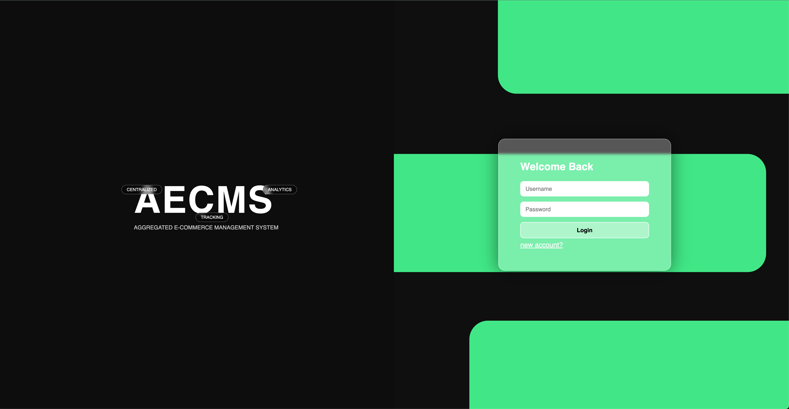
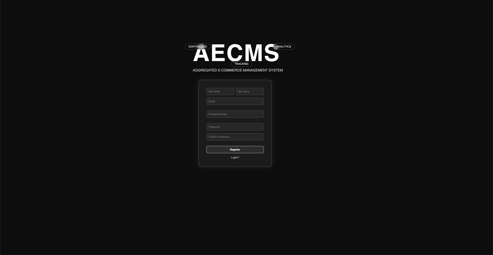
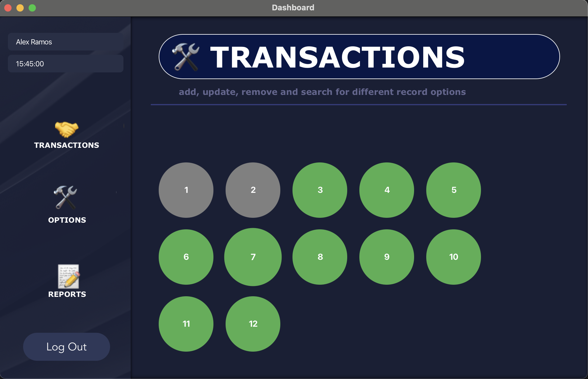
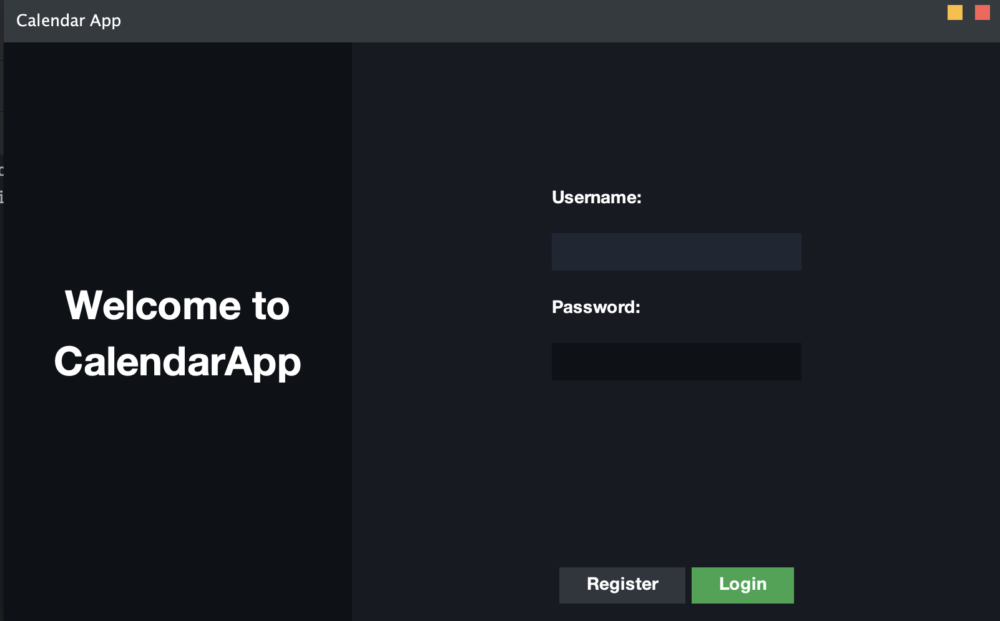

# Hi there 👋, I'm Philip A.

## About Me
I’m a **second-year BSIT student** at **De La Salle University**, passionate about technology and building real-world skills. I’m currently exploring **web development**, **systems administration**, and **cybersecurity**.

## Skills & Learning
- **Programming Languages:** C, Java, PHP, JavaScript, HTML, CSS
- **Current Stack:** Full web stack projects using PHP, JS, HTML, CSS

## Learning Milestones

*The project may not be fully described as this aims to be brief; for more information, I made an effort to update the README files of each project!*

## • AECMS (Integrative Programming Project)
**2026 · Second Year · Ongoing**

*A web application for online sellers using HTML/CSS/JS/PHP/SQL*

🔗 https://github.com/PeelyMart/AECMS

  
  

  <em>Login and Register Page by ME!</em>

## • PokeSearch Web App (Personal Development)
**2026 · Second Year · Personal Project**

*A web application integrating a public REST API*

🔗 https://github.com/PeelyMart/PokeSearch

  
  

  <em>Search page and results page of PokeSearch web app</em>

A web application that demonstrates frontend interaction with a public REST API using JavaScript’s fetch() method. The project focuses on API consumption, asynchronous programming, and clean UI design using CSS. Developed as early preparation for my Integrative Programming course to strengthen my understanding of modern web development fundamentals. 

Alongside API data fetching, the project required implementing conditional logic for dynamic asset rendering. Pokémon type data retrieved from the API is processed to determine which locally stored sprite images should be displayed. The logic supports both single-type and multi-type Pokémon, ensuring accurate visual representation based on attribute combinations.

## • QuickServePOS — SQL Database Project
**2025 · Second Year · First Term**

A database-driven **Point of Sale (POS)** 

  
  

  <em>The login page and dashboard of quickServe | Contributor of initial layout and flow plan — Developed using JavaFX by another member</em>

system developed for my **Information Management** course. The project focused on modeling and managing front-end restaurant operations such as table tracking, order recording, payments, and reporting using relational databases and SQL.

This milestone strengthened my understanding of **project coordination** in a larger team setting and reinforced my growing interest in **backend and system-level features**, particularly auditing and traceability.

🔗 https://github.com/PeelyMart/QuickServePos

## • CalendarJournalApp (Java)
**2025 · First Year · Third Term**

A calendar desktop-application 

  
  

  <em>The login page and dashboard of CalendarJournalApp | Main contributor — Developed using JavaSwing</em>

A desktop application developed for my **Object-Oriented Programming** course, marking my transition into building complete Java applications.

**Key takeaways:**
- Full Java application development
- UX-focused workflow design
- Pair-based project coordination
- Introductory MVC planning
- Manual GUI development using Java Swing

🔗 https://github.com/PeelyMart/CalendarJournalApp

## Goals
- Building skills to **freelance in web development**
- Pursuing a **serious career** in **systems administration** or **cybersecurity**

## Fun Fact
- I enjoy **learning by doing**, building projects, and exploring the latest in tech trends.
